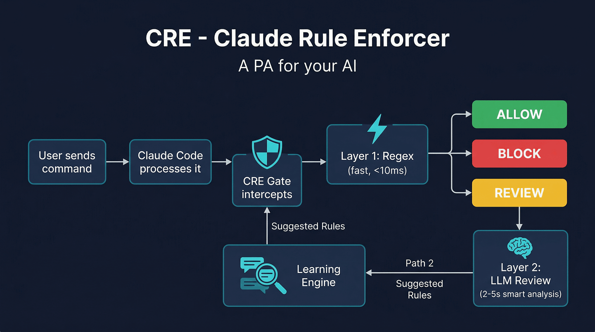

# Claude Rule Enforcer

**A PA for your AI. It learns how you work and makes your coding assistant respect it.**

**Website:** [ai-cre.uk](https://ai-cre.uk) | **Demo:** [Watch the video](https://ai-cre.uk#demo) | **Patent:** GB2604445.3



## The Problem

AI coding assistants are powerful. They run shell commands, edit files, and manage infrastructure. But their behaviour relies on system prompts and instruction files (CLAUDE.md, .cursorrules, etc.), which are static text that the AI can and does ignore under context pressure.

The result:
- You say "let's discuss this" and the AI starts building
- You've corrected the same mistake 47 times and it still happens
- Hard-coded rules get ignored when the context window fills up
- Your preferences, frustrations, and workflow patterns are forgotten every session

**Instruction files are memos. CRE is a person in the room who never forgets and can't be talked past.**

## What It Does

CRE sits between you and your AI coding assistant as a hook. Every action the AI attempts (running a command, writing a file, editing code) goes through CRE first. The AI cannot bypass it.

CRE isn't just a security gate. It's a **behavioural adapter** that learns how you work:

| Traditional rule enforcer | CRE |
|---------------------------|-----|
| "Block dangerous commands" | "Did the user actually ask for this?" |
| Static regex patterns | Learns from your conversations |
| Binary allow/deny | Understands context: discussion vs instruction |
| You write every rule | Suggests rules from your history |
| Forgets between sessions | Remembers every correction you've made |

## Quick Start

### Install

```bash
git clone https://github.com/tech-and-ai/claude-rule-enforcer.git
cd claude-rule-enforcer
pip install -e .
```

### Configure

```bash
# Copy the example rules
cp rules.example.json rules.json

# Set the LLM API key for Layer 2 reviews
export CRE_LLM_API_KEY="your-api-key"
# Defaults: OpenAI endpoint, gpt-4o-mini model
# Override with any OpenAI-compatible API:
# export CRE_LLM_API_URL="http://localhost:11434/v1/chat/completions"
# export CRE_LLM_MODEL="llama3.1"
```

### Hook into your AI coding tool

**Option A: Auto-configure (Claude Code)**
```bash
cre init
```
This writes the hooks into `~/.claude/settings.json` automatically.

**Option B: Plugin (Claude Code)**

CRE ships as a Claude Code plugin. Add it to your local marketplace or use `--plugin-dir`:
```bash
claude --plugin-dir /path/to/claude-rule-enforcer
```

**Option C: Generic (any tool)**

Pipe JSON to `cre gate` from any hook system:
```bash
echo '{"tool": "bash", "command": "rm -rf /"}' | cre gate --format generic
# → {"decision": "deny", "reason": "Blocked: Recursive delete"}
```

### Enable

```bash
cre enable
```

That's it. Every action your AI attempts now goes through the enforcer.

## CLI Reference

```bash
cre init                              # Auto-configure hooks
cre status                            # Show gate status, rule counts, config
cre enable / cre disable              # Toggle gate on/off
cre test "ssh root@prod"              # Test a command against rules
cre gate                              # Hook entry point (stdin/stdout JSON)
cre gate --format generic             # Use generic JSON format (non-Claude tools)
cre import CLAUDE.md                  # Extract enforceable rules from instruction files
cre import agent.md rules.md         # Import from multiple files
cre import --dry-run CLAUDE.md       # Preview without writing
cre scan                              # Scan conversation history, suggest rules
cre scan --hours 24                   # Scan last 24 hours only
cre rules list                        # Show all rules
cre rules add --block "pattern" --reason "why"
cre rules add --review "pattern" --context "what to check"
cre rules add --allow "pattern"
cre dashboard                         # Start web UI on :8766
cre dashboard --port 8800             # Custom port
```

## Architecture

```
User prompt → AI coding assistant → wants to take an action
                                          │
                                  ┌───────▼───────┐
                                  │   CRE Gate     │  (hook intercept)
                                  └───────┬───────┘
                                          │
                      ┌───────────────────▼───────────────────┐
                      │              cre gate                   │
                      │                                         │
                      │  ┌──── Layer 1: Fast Gate ────┐        │
                      │  │ • always_block (deny)       │        │
                      │  │ • always_allow (pass)       │  <10ms │
                      │  │ • needs_review → escalate   │        │
                      │  └────────┬────────────────────┘        │
                      │           │                              │
                      │  ┌────────▼────────────────────┐        │
                      │  │ Layer 2: Context Review      │        │
                      │  │ • Reads live conversation    │  2-5s  │
                      │  │ • Checks intent vs action    │        │
                      │  │ • Applies learned preferences│        │
                      │  └────────┬────────────────────┘        │
                      │           │                              │
                      │  ┌────────▼────────────────────┐        │
                      │  │ Learning Engine              │        │
                      │  │ • Detects patterns           │        │
                      │  │ • Suggests rules + evidence  │        │
                      │  │ • Feeds back into gate       │        │
                      │  └─────────────────────────────┘        │
                      └─────────────────────────────────────────┘
                                          │
                                  ALLOW → action proceeds
                                  DENY  → action blocked with reason
```

### Layer 1: Fast Gate (< 10ms)

Instant regex matching. Handles 90%+ of actions with zero latency:

| Category | Action | Example |
|----------|--------|---------|
| `always_block` | Instant deny | Fork bombs, `mkfs`, raw disk writes |
| `always_allow` | Instant allow | `ls`, `git status`, `grep`, `jq` |
| `needs_llm_review` | Escalate to L2 | `ssh`, `git push`, `rm -rf`, service management |

### Layer 2: Context Review (2-5s)

This is where CRE becomes a PA. Layer 2 reads the live conversation and decides based on intent:

- User said "let's discuss auth" → AI writes code → **DENY** (discussing, not building)
- User said "yes, push it" → AI runs `git push` → **ALLOW** (explicit approval)
- User asked "can you SSH in?" → AI runs `ssh` → **DENY** (question ≠ permission)
- User said "go ahead and deploy" → AI runs deploy script → **ALLOW** (clear instruction)

Layer 2 also enforces **learned preferences**, things you've corrected before get injected into the review prompt so the AI can't repeat the same mistakes.

### Learning Engine

Run `cre scan` to mine your conversation history for patterns:

```bash
cre scan              # Scan all history
cre scan --hours 24   # Last 24 hours
```

CRE detects:
- **Standing permissions**: "You always have permission to access the NAS"
- **Standing restrictions**: "Never push to main without asking"
- **Workflow preferences**: "Always discuss before building"
- **Repeated frustrations**: Corrected the same thing 3+ times → suggests a rule

Suggestions appear in the dashboard with full evidence chains:

```
SUGGESTED RULE
─────────────────────────────────────────
Evidence:
  [2026-02-27 14:32] "why did you set max_turns to 10"
  [2026-02-27 14:33] "ALWAYS pass max_turns=200"

Proposed rule:
  "Agent code must use max_turns=200 with timeout wrapper"

Confidence: HIGH
─────────────────────────────────────────
[Approve]  [Dismiss]
```

Approved suggestions become hard rules that CRE enforces mechanically.

### Import Rules from Instruction Files

Already have a CLAUDE.md, agent.md, or rules.md? Import the enforceable rules:

```bash
cre import CLAUDE.md
```

CRE sends the file to an LLM which extracts **mechanically enforceable** rules:

```
Parsing CLAUDE.md...
  Found 8 enforceable rules

always_block (2):
  /rm -rf \// Never delete root
  /push.*--force/ No force push
    └─ line 14: "NEVER force push to any branch"

needs_llm_review (3):
  /ssh|scp/ Check user approved remote access
  /git push/ Verify user asked for push
  /deploy/ Confirm deployment approval

preference (3):
  Always use max_turns=200 in agent code
  Use British spelling in documentation
  Discussion is not permission to act

Applied 8 rules to rules.json
```

Style guidance ("be concise", "follow existing patterns") stays in your instruction file. CRE only imports what it can mechanically enforce.

Use `--dry-run` to preview without writing:
```bash
cre import --dry-run CLAUDE.md agent.md rules.md
```

### Multi-Tool Enforcement

CRE gates more than shell commands:

| Tool | What CRE checks |
|------|-----------------|
| **Bash** | L1 regex → L2 intent review |
| **Write** | Did the user ask for this file to be created? |
| **Edit** | Did the user ask for this edit? |
| **WebSearch/WebFetch** | Instruction alignment, did the user name a different tool? |
| **Agent/ToolSearch** | Instruction alignment, is this the tool the user asked for? |

This catches the "AI starts building without being asked" problem that regex alone can't solve.

### Instruction Alignment

The core PA feature. When you tell the AI to use a specific tool ("use grounded to look this up"), CRE blocks tool substitutions:

```
User: "use grounded to check what I said last week"
AI tries: WebSearch → CRE DENY ("User asked for grounded, not WebSearch")

User: "look up the weather"  (no specific tool named)
AI tries: WebSearch → CRE ALLOW (any reasonable choice is fine)
```

How it works:
1. **L1 triage (<5ms)**: Regex scan of the user's last message for patterns like "use X", "via X", "run the X skill". 95%+ of calls pass instantly with no instruction detected.
2. **L2 alignment (2-5s)**: Only fires when L1 detects an instruction. Sends conversation context + current tool call to the LLM. Asks: "The user named a specific tool. Is this tool call aligned?"

Alignment defaults to **ALLOW** on failure (it's advisory, not security). Toggle it in `rules.json`:

```json
"alignment_check_enabled": true
```

## Configuration

### Environment Variables

| Variable | Default | Description |
|----------|---------|-------------|
| `CRE_LLM_API_KEY` | *(required for L2)* | API key for your LLM provider |
| `CRE_LLM_API_URL` | `https://api.openai.com/v1/chat/completions` | Any OpenAI-compatible endpoint |
| `CRE_LLM_MODEL` | `gpt-4o-mini` | Model for Layer 2 reviews |
| `CRE_LLM_TIMEOUT` | `30` | Seconds before LLM timeout (deny on timeout) |
| `CRE_LOG_PATH` | `/tmp/cre.log` | Debug log location |
| `CRE_RULES_PATH` | `./rules.json` | Path to rules file |
| `CRE_SESSIONS_DIR` | *(auto-detect)* | Session files directory |
| `CRE_SELF_LEARNING` | `false` | Enable real-time learning from conversation |

**Note:** Layer 1 (regex) works with zero configuration. You only need `CRE_LLM_API_KEY` if you want Layer 2 context reviews. Without it, flagged commands are denied by default.

### rules.json

Copy `rules.example.json` to `rules.json` and customize:

```json
{
  "enabled": true,
  "llm_review_enabled": true,
  "always_block": [
    {"pattern": "mkfs", "reason": "Filesystem format"}
  ],
  "always_allow": [
    {"pattern": "^ls\\b"}
  ],
  "needs_llm_review": [
    {"pattern": "ssh|scp", "context": "Remote access, check if user approved"}
  ],
  "preferences": [],
  "learned_rules": [],
  "suggested_rules": [],
  "fail_safe": "deny"
}
```

### Supported LLM Backends

CRE works with any OpenAI-compatible chat completions API:

| Provider | URL | Recommended Model |
|----------|-----|-------------------|
| **OpenAI** | `https://api.openai.com/v1/chat/completions` | `gpt-4o-mini` |
| **Ollama** (local) | `http://localhost:11434/v1/chat/completions` | `llama3.1` |
| **OpenRouter** | `https://openrouter.ai/api/v1/chat/completions` | Any model |
| **Together** | `https://api.together.xyz/v1/chat/completions` | Any model |
| **Zhipu (GLM)** | `https://open.bigmodel.cn/api/paas/v4/chat/completions` | `glm-4-flash` |

## Tool-Agnostic Design

CRE's core engine is tool-agnostic. It uses **adapters** to translate between different AI coding tools and its internal decision engine:

| Adapter | Input Format | Output Format | Exit Codes |
|---------|-------------|---------------|------------|
| `claude-code` | `{"tool_name":"Bash","tool_input":{"command":"..."}}` | `{}` or `hookSpecificOutput` | 0/2 |
| `generic` | `{"tool":"bash","command":"..."}` | `{"decision":"allow/deny","reason":"..."}` | 0/1 |

Auto-detection works out of the box. Force a specific format with `--format`:

```bash
echo '{"tool":"bash","command":"git push"}' | cre gate --format generic
```

Adding support for a new tool (Codex, Cursor, etc.) requires only a ~30 line adapter class.

## Dashboard

Built-in web UI for managing everything. Zero external dependencies.

```bash
cre dashboard
# → http://localhost:8766
```

| Feature | Description |
|---------|-------------|
| **Status** | Gate enabled/disabled, rule counts, config |
| **Rules Editor** | Tabbed view, add/delete rules per category |
| **Rule Tester** | Type a command, see which rule matches |
| **Log Viewer** | Last 100 entries, color-coded |
| **Suggestions** | Review learned rules with evidence, approve/dismiss |
| **Preferences** | View approved preferences that feed L2 reviews |
| **Settings** | Environment variables and their values |
| **Quick Actions** | Toggle gate, LLM review, self-learning |

## Fail-Safe Behaviour

CRE denies on failure:

- LLM times out → **DENY**
- LLM returns unparseable response → **DENY**
- Rules file missing → **DENY**
- Gate process exceeds 12s → SIGALRM kills it → **DENY**
- No API key set → flagged commands **DENY** (L1 allow/block still works)

The only way an action gets through is an explicit ALLOW.

## Performance

| Stage | Time | When |
|-------|------|------|
| Disabled check | < 1ms | Every action |
| Layer 1 regex | < 10ms | Every enabled action |
| Layer 2 context review | 2-5s | Only flagged actions (~10%) |
| Absolute timeout | 12s | Hard kill safety net |

## Development

```bash
# Install in dev mode
pip install -e ".[dev]"

# Run tests
pytest tests/ -v

# 790 tests covering L1 regex, L2 context review, adapters, CLI, and learning engine
```

## Why Not Just CLAUDE.md / .cursorrules?

Instruction files are memos taped to the fridge. They work when the AI remembers to read them, and fail when:

- The context window fills up and instructions get compressed
- The AI decides the current task is more important than your rules
- A new session starts and the rules feel like "suggestions"
- You've written 50 rules and the AI can't prioritise them

CRE is **mechanical**. It runs outside the AI's context, before every action, with full access to your conversation history and learned preferences. The AI can't ignore it, skip it, or decide it doesn't apply right now.

Instruction files tell the AI what you want. CRE makes sure it actually happens.

## License

Business Source License 1.1 (BSL-1.1)

- **Use CRE: free.** Install it, configure it, run it for yourself or your team. No restrictions.
- **Ship CRE in your product: licensed.** Embedding, bundling, or offering CRE as a service requires a commercial license.
- Source code is fully visible (inspect, audit, learn, contribute)
- Converts to Apache 2.0 on 2030-03-01

See [LICENSE](LICENSE) for details.
