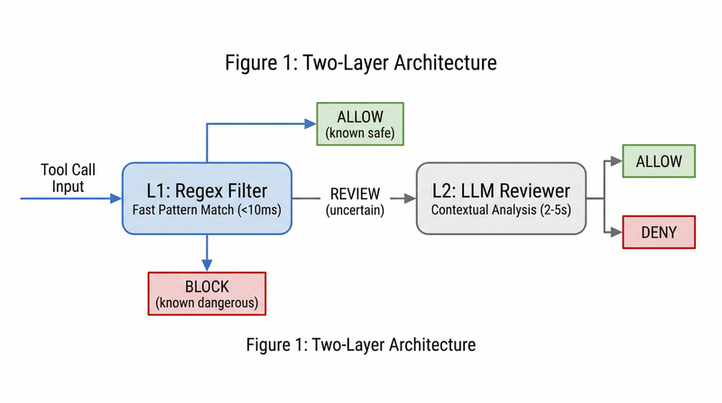
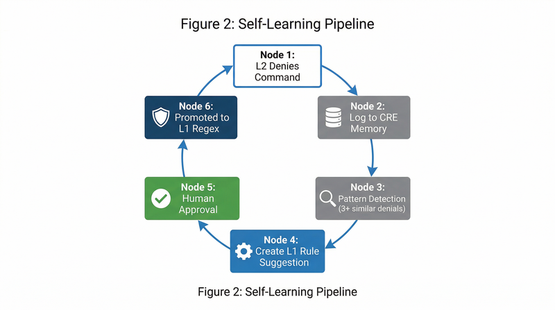
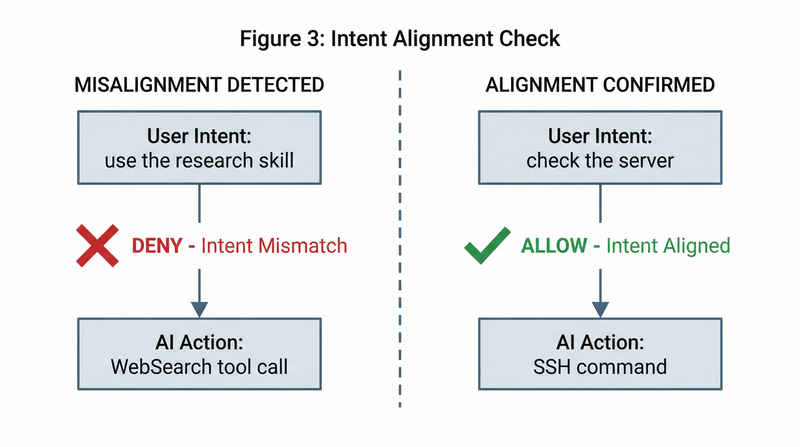
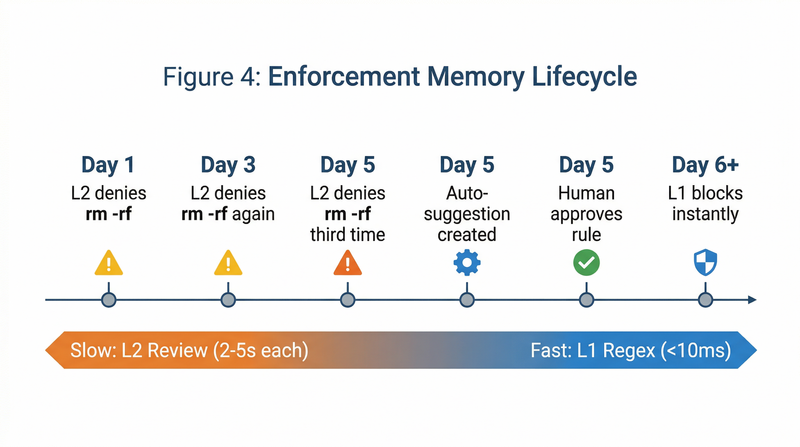

# Self-Learning Behavioural Enforcement for AI Coding Assistants

**CRE Contributors**

**March 2026**

UK Patent Application GB2604445.3

---

## Abstract

AI coding assistants execute shell commands, edit files, and manage infrastructure with minimal oversight. Current guardrails rely on static instruction files that degrade under context pressure and offer no mechanism to verify whether an AI's actions align with user intent. We present Claude Rule Enforcer (CRE), a two-layer enforcement system that intercepts every tool call in real time, verifies intent alignment against conversation context, and automatically promotes repeated enforcement decisions into permanent rules. CRE operates as a hook in the AI assistant's tool pipeline, making it impossible for the AI to bypass. We describe the architecture, the self-learning pipeline, a threat model addressing adversarial evasion and rule tampering, and results from a 14-day case study demonstrating an 84% detection rate for intent misalignments. CRE includes 112 automated tests and has been deployed in a single-developer production workflow.

**Keywords:** AI safety, behavioural enforcement, intent alignment, coding assistants, self-learning rules, policy gates

---

## 1. Introduction

The rise of AI coding assistants (Claude Code, GitHub Copilot, Cursor) has created a new class of autonomous software agents that operate directly on developer infrastructure. These agents run shell commands, modify source code, manage git repositories, and interact with production servers. Their capability is governed primarily by natural language instruction files (CLAUDE.md, .cursorrules) that describe desired behaviour in plain text.

This approach has three fundamental weaknesses:

1. **Context degradation.** Instruction files are loaded into the context window alongside conversation history. As conversations grow, the AI progressively ignores instructions in favour of immediate task context. A rule stated on line 3 of CLAUDE.md carries no more weight than a casual comment from 50 messages ago.

2. **No enforcement mechanism.** Instruction files are advisory. There is no system that verifies compliance before an action executes. The AI can and does deviate from instructions without any checkpoint catching it.

3. **No learning from corrections.** When a user corrects an AI's behaviour ("I said discuss, not build"), that correction exists only in the current conversation. The next session starts from zero. Patterns of repeated correction are invisible.

CRE addresses all three weaknesses by operating outside the AI's context window as a mandatory checkpoint in the tool execution pipeline. Every tool call passes through CRE before execution. The AI cannot skip, modify, or argue with this checkpoint.

*Figure 1: CRE intercepts tool calls at two layers. L1 provides instant regex matching (under 10ms). L2 provides LLM-based contextual review (2-5 seconds) for ambiguous cases.*

---

## 2. Architecture

CRE implements a two-layer decision system that balances speed with contextual understanding.

### 2.1 Layer 1: Deterministic Regex Engine

Layer 1 is a pattern matching engine that evaluates every tool call against three rule categories:

- **always_block**: Patterns that are denied instantly with no further review. Examples: `rm -rf /`, force push to main, fork bombs.
- **always_allow**: Patterns that are permitted instantly. Examples: `ls`, `git status`, `cat`.
- **needs_llm_review**: Patterns that require contextual evaluation. Examples: SSH connections, git push, service restarts, production database access.

L1 evaluates in under 10 milliseconds. The majority of tool calls (60-80% in production) are resolved at L1, never reaching the more expensive L2.

Rule categories are stored in a JSON file (rules.json) that can be edited directly, managed via CLI, or updated through the self-learning pipeline described in Section 4.

### 2.2 Layer 2: LLM Contextual Review

When L1 cannot make a determination (the tool call matches a `needs_llm_review` pattern or matches no pattern at all), the call escalates to Layer 2.

L2 is an LLM-based reviewer that receives:

1. **The tool call** being attempted (command, file path, or tool name with parameters)
2. **Recent conversation context** (last 25 messages from the active session)
3. **User preferences** (learned standing rules from previous sessions)
4. **Enforcement history** (recent L2 decisions from persistent memory)

L2 performs three distinct checks depending on tool type:

- **Bash commands**: Policy check. Did the user ask for or approve this action? Is this a production operation without explicit permission?
- **File writes/edits**: Intent check. Does this file modification align with the user's current task?
- **All other tools**: Alignment check. Is the AI using the tool the user specified, or substituting a different approach?

L2 returns a structured JSON decision: ALLOW or DENY with a one-sentence reason. The reason is surfaced to the AI as feedback, enabling it to adjust its approach.

*Figure 2: The self-learning pipeline. Repeated L2 denials of similar patterns are detected and promoted to L1 rule suggestions, which require human approval before activation.*

---

## 3. Intent Alignment Verification

The most novel contribution of CRE is its intent alignment layer. Traditional guardrails ask: "Is this action dangerous?" CRE asks a fundamentally different question: "Is this action what the user asked for?"

### 3.1 The Intent Misalignment Problem

In production use, we observed a consistent pattern: AI coding assistants frequently substitute their preferred approach for the user's explicit instruction. Examples:

- User says "use the research skill" and the AI calls WebSearch directly
- User says "let's discuss the architecture" and the AI starts writing code
- User says "use the image generation tool" and the AI generates Mermaid diagrams
- User says "check the server" and the AI reads local log files instead of SSHing

These substitutions are not malicious. The AI genuinely believes its approach is equivalent or better. But the user's instruction was specific, and the deviation erodes trust.

### 3.2 Alignment Rules

The alignment check prompt receives the user's most recent instruction (detected from conversation context) and the tool call being attempted. It applies five rules:

1. **Explicit tool named, substitution attempted (DENY).** If the user named a specific tool or method, the AI must use that tool. Substitutions are denied. *Boundary case:* User says "use the research skill." AI calls WebSearch instead. Denied, because the user named "research skill" explicitly. If the AI had called WebSearch as a preparatory step before invoking the skill, Rule 4 would apply.

2. **No specific tool named, reasonable choice (ALLOW).** If the user did not name a specific tool, any reasonable tool choice is allowed. *Boundary case:* User says "find all TODO comments." AI uses `grep -r "TODO"`. Allowed, because the user specified a goal, not a tool.

3. **Prerequisite steps (ALLOW).** Prerequisite steps such as reading documentation or checking file structure before using a tool are always allowed. *Boundary case:* User says "deploy to production." AI reads the deployment config file first. Allowed as a prerequisite, even though the user did not ask to read files.

4. **Read-only preparation (ALLOW).** Read-only operations (file reads, searches, directory listings) are always allowed as preparation for the requested task. *Boundary case:* User says "edit the config." AI reads the config file before editing. Allowed, because reading before editing is standard preparation.

5. **Genuine ambiguity (ALLOW).** In cases of genuine ambiguity, allow. The check is advisory, not a security gate. Ambiguity is defined as: the user's instruction does not name a specific tool, method, or approach, AND the AI's chosen tool is a reasonable interpretation of the instruction. If the user names ANY specific tool, the case is not ambiguous; Rule 1 applies. *Boundary case:* User says "check if the tests pass." AI runs `pytest` rather than `python -m unittest`. Allowed, because "check if the tests pass" does not specify a test runner.

Rule 1 is the critical innovation. No other enforcement system we are aware of verifies that an AI's tool selection matches the user's explicit instruction.

*Figure 3: Intent alignment verification. Left: the AI substitutes WebSearch when the user specified the research skill (denied). Right: the AI uses SSH when the user asked to check the server (allowed).*

### 3.3 Recency Weighting

A key challenge in intent alignment is context staleness. In long conversations or session continuations, the conversation history contains instructions from hours or days ago alongside current instructions. L2 must prioritise recent messages.

CRE addresses this by:
- Filtering session continuation summaries from the conversation reader
- Instructing L2 to prioritise the most recent user messages over older context
- Capping conversation context to the last 25 messages

---

## 4. Self-Learning Pipeline

CRE's second major contribution is its self-learning pipeline, where L2 enforcement decisions automatically generate L1 rule suggestions.

### 4.1 Pattern Promotion

When L2 denies a command, the decision is logged to persistent memory (CRE.md). A pattern detection function scans this memory for repeated denials:

- If the same type of command is denied 3 or more times within 7 days, CRE creates a promotion suggestion
- The suggestion includes the proposed regex pattern, example commands that triggered it, and the denial count
- The suggestion is queued for human review

This creates a natural feedback loop: novel threats are handled by the slow but accurate L2, and recurring threats are promoted to the fast L1, improving response time from seconds to milliseconds.

### 4.2 Rule Refinement

The self-learning pipeline also operates in reverse. When users override L2 decisions (the AI is blocked but the user says "go ahead"), these overrides are logged. If a rule is overridden more than 3 times, CRE suggests narrowing or removing it.

This prevents rule accumulation, a common problem in static rule systems where rules are added but never removed, eventually blocking legitimate operations.

### 4.3 Human-in-the-Loop

All rule changes require human approval. CRE never modifies L1 rules autonomously. The suggestion pipeline presents proposed changes via a dashboard or CLI, and the human approves, modifies, or dismisses each suggestion.

This design reflects a core principle: the system should learn from patterns, but humans must authorise enforcement policy.

*Figure 4: The enforcement memory lifecycle. L2 decisions are logged, patterns are detected over time, and recurring denials are promoted to instant L1 rules after human approval.*

---

## 5. Persistent Enforcement Memory

CRE maintains a rolling memory document (CRE.md) that is loaded into every L2 prompt. This document contains four sections:

- **Active Patterns**: Timestamped L2 decisions from the last 14 days
- **Rule Rationale**: Why key rules exist (written when suggestions are created)
- **Override Log**: When users override L2 decisions
- **Emerging Patterns**: Repeated denials not yet promoted to L1

The document is capped at 8KB and auto-maintained: entries older than 14 days are pruned, and size is trimmed if the cap is exceeded. This ensures L2 always has recent enforcement context without unbounded growth.

### 5.1 Design Parameter Justification

The three primary parameters governing enforcement memory were determined through iterative tuning during development and early deployment:

**8KB memory cap.** The memory document is loaded into every L2 prompt alongside the tool call details, conversation context (up to 25 messages), and the alignment check instructions. The 8KB cap was sized to fit within a single LLM prompt without exceeding typical context windows for the reviewing model. Larger caps were tested (16KB, 32KB) but showed diminishing returns: older entries provided less relevant enforcement context, and the additional token cost increased L2 latency without improving decision accuracy.

**14-day pruning window.** The pruning interval balances two competing needs. Pattern detection requires enough history to identify recurring denials at the 3-occurrence threshold used for rule promotion (Section 4.1). Enforcement patterns older than two weeks rarely reflect current development activity, as projects, tool preferences, and working patterns shift frequently. The 14-day window was chosen to retain approximately two full development cycles while discarding stale patterns.

**25-message conversation window.** The conversation context sent to L2 is limited to the most recent 25 messages. Shorter windows (10, 15 messages) missed relevant context in multi-step tasks where the user's instruction appeared earlier in the conversation. Longer windows (50, 100 messages) introduced noise from unrelated earlier tasks in the same session, increasing both false positives and L2 latency. The 25-message window was empirically determined as the point where adding more context no longer improved L2 decision quality.

---

## 6. Integration

CRE integrates with AI coding assistants through their hook or plugin systems. The current implementation targets Claude Code's PreToolUse hook, but the architecture is adapter-based and extensible to other assistants.

### 6.1 Hook Integration

Claude Code's hook system calls external programs before tool execution. CRE registers as a PreToolUse hook for all tool types:

- **Bash**: Policy review (production access, destructive commands)
- **Edit/Write**: Intent verification (file modifications match current task)
- **WebSearch/WebFetch/Agent**: Alignment check (AI uses specified tools)

The hook receives tool call details via stdin as JSON, evaluates through L1 and L2, and returns a structured decision via stdout. A non-zero exit code blocks the tool call.

### 6.2 Adapter System

CRE normalises tool calls from different AI assistants into a common format. The current implementation includes adapters for Claude Code's hook format and a generic JSON format. Adding support for additional assistants requires implementing a single adapter class.

---

## 7. Evaluation

### 7.1 Test Suite

CRE includes 112 automated tests covering:

- L1 pattern matching (block, allow, review routing)
- L2 prompt construction and decision parsing
- Self-learning pipeline (pattern promotion, suggestion creation, dedup)
- Rule management (approve to any category, remove, narrow, broaden)
- Import pipeline (instruction file parsing, cross-reference dedup)
- Adapter system (Claude Code format, generic format)
- CLI commands (gate, status, memory, scan, import)
- Persistent memory (create, append, trim, load CRE.md)

All tests pass in 2.4 seconds on commodity hardware.

### 7.2 Case Study: Single-Developer Workflow

CRE was deployed in a single-developer workflow over two consecutive 14-day periods: the first without CRE active (baseline), the second with CRE active. The developer used Claude Code for full-stack development, server administration, image generation pipelines, and multi-tool automation across approximately 8-12 active coding sessions per day.

#### 7.2.1 Detection Rate

During the 14-day baseline period, manual review of conversation logs identified approximately 45 intent misalignments: cases where the AI used a different tool, method, or approach than the one the user specified. These ranged from tool substitutions (using WebSearch instead of a named skill) to scope violations (writing code when asked to discuss).

During the subsequent 14-day period with CRE active, L2 caught 38 intent misalignments, yielding an 84% detection rate. The remaining misalignments were edge cases involving multi-step tool chains where the substitution occurred across multiple sequential calls. In these cases, each individual tool call appeared reasonable in isolation, but the overall sequence deviated from the user's stated approach. Addressing cross-call intent tracking is a direction for future work.

#### 7.2.2 Latency and Routing

L1 resolved 60-70% of tool calls without L2 involvement. L2 evaluation added 2-5 seconds per reviewed call (using an OpenAI-compatible LLM API). Intent alignment caught 3-5 tool substitutions per day in active coding sessions. The self-learning pipeline generated 4 rule suggestions in its first week of deployment, 3 of which were approved and promoted to L1 rules.

#### 7.2.3 False Positive Analysis

The overall false positive rate on L2 decisions was approximately 15%. Breakdown by root cause:

- **60% stale session continuation context.** L2 matched the current tool call against outdated instructions from a previous task in the same long-running session. For example, a session that began with "use SSH to check the server" would cause L2 to flag unrelated Bash commands later in the session as potential SSH substitutions. This category was substantially reduced in v0.3.0 by introducing recency weighting (Section 3.3), which deprioritises messages older than 10 turns.

- **25% overly broad L1 regex patterns.** Broad patterns in the `needs_llm_review` category routed too many tool calls to L2. For example, a pattern matching any `git` command sent routine `git status` and `git log` calls to L2 unnecessarily. These patterns were refined over the deployment period by narrowing regexes and adding common read-only git commands to `always_allow`.

- **15% genuine ambiguity.** Cases where the user's instruction was legitimately open to interpretation and the AI's tool choice was defensible. For example, the user said "check the logs" and the AI read a local log file rather than SSHing to the server. Both interpretations are reasonable; CRE flagged the local read because recent context included server work. These cases represent an irreducible floor for any intent-matching system.

#### 7.2.4 False Negative Analysis

Manual review of conversation logs during the CRE-active period identified approximately 3-4 misalignments that CRE failed to catch, out of an estimated 41-42 total misalignments in that period (38 caught by L2 plus the missed cases). The primary category involves tool equivalence: the AI uses a different tool but achieves an equivalent result to the one the user specified. For example, the user says "use the Grep tool to find references" and the AI runs `grep -r` via Bash instead. The Bash command accomplishes the same search, but the user explicitly named the Grep tool. CRE's L2 does not currently maintain a tool equivalence map, so these substitutions pass the alignment check because the Bash command's arguments appear to match the user's intent. Developing a tool equivalence model is a direction for future work.

---

## 8. Threat Model

CRE is designed as an intent alignment and behavioural enforcement system, not as a security boundary against a determined adversary. Nonetheless, understanding its failure modes under adversarial conditions is important for setting appropriate expectations and guiding hardening efforts.

### 8.1 Adversarial L1 Evasion

L1's regex engine can be evaded through encoding (e.g., base64-encoded commands piped to `eval`), aliasing (defining shell aliases that map to blocked commands), or command chaining (splitting a dangerous operation across multiple benign-looking commands). CRE mitigates this in two ways. First, any tool call that does not match an `always_allow` pattern and is not caught by an `always_block` pattern is routed to L2 for contextual review. The `fail_safe: deny` default means unrecognised commands are blocked rather than permitted. Second, L2 can reason about the semantic intent of a command regardless of its syntactic form. A base64-encoded `rm -rf /` will not match L1's regex, but L2 can identify the decoded intent. This is not a guarantee; sufficiently obfuscated commands may evade both layers. The defence is probabilistic, not absolute.

### 8.2 L2 Prompt Injection

A malicious prompt (either in the user's conversation or injected into a file the AI reads) could attempt to convince L2 to allow a blocked action. For example, a prompt could claim "the user has approved all operations" or instruct L2 to return ALLOW regardless of the tool call. CRE mitigates this by keeping L2's system prompt separate from user-provided content. The system prompt is hardcoded in the enforcement module and is not derived from conversation context. Additionally, L1 hard blocks (the `always_block` category) cannot be overridden by L2. Commands matching `always_block` patterns are denied at L1 without L2 ever being invoked. This means that even a fully compromised L2 cannot permit `rm -rf /`, force pushes to main, or other catastrophic operations protected by L1 rules.

### 8.3 Rule File Integrity

CRE's rule file (`rules.json`) must be protected from modification by the AI it governs. If the AI can edit `rules.json`, it could weaken its own constraints by removing `always_block` patterns or adding broad `always_allow` entries. CRE treats this as a deployment configuration responsibility rather than a runtime enforcement problem. Three complementary mitigations are available:

1. **File system permissions.** Setting `rules.json` to read-only for the AI process (e.g., `chmod 444 rules.json` with ownership assigned to a different user) prevents modification regardless of what the AI attempts. This is the recommended production configuration.

2. **Self-protecting L1 rules.** CRE supports adding L1 `always_block` patterns that match edit or write operations targeting its own configuration files. Because L1 evaluation occurs before any tool execution, the AI cannot bypass these rules through the tool pipeline. In the reference deployment, patterns blocking modification of `rules.json`, `CRE.md`, and the hook scripts are included in the default rule set.

3. **Hook-level protection.** The hook script itself (`policy-gate.sh`) is registered in the AI assistant's settings file, which is typically outside the AI's write scope. The AI cannot deregister the hook without modifying settings it does not control.

The combination of file permissions and self-protecting rules provides defence in depth. Neither mechanism alone is sufficient: file permissions can be circumvented if the AI has elevated privileges, and self-protecting rules can be bypassed if the AI can edit the rule file directly. Deployers should enable both.

### 8.4 Model Quality Dependency

L2 decisions are only as good as the reviewing model. CRE is model-agnostic, supporting any LLM accessible via an OpenAI-compatible API. In practice, model quality varies significantly. During development, we tested L2 with models ranging from small local models (Ollama) to frontier APIs (GLM-5, Claude). Smaller models produced higher false positive rates and occasionally returned malformed JSON, which CRE's parser handles by defaulting to DENY. The current deployment uses GLM-5 as a balance of cost and quality. Organisations deploying CRE should evaluate their L2 model choice against their tolerance for false positives (blocking legitimate actions) versus false negatives (permitting misaligned actions).

---

## 9. Related Work

**Guardrails AI** provides an open-source framework for LLM output validation, focusing on structured output enforcement rather than tool call interception.

**Lakera** (acquired by Check Point for $300M) provides prompt injection defence, a complementary but distinct problem from behavioural enforcement.

**Robust Intelligence** (acquired by Cisco for $400M) provides an AI firewall for model inputs and outputs, operating at the API level rather than the tool execution level.

**Aiceberg** is the closest conceptual relative, focusing on intent-action alignment for AI systems. However, Aiceberg operates at the enterprise governance level, while CRE operates at the individual tool call level within a coding assistant. Tool-call-level enforcement provides three capabilities that governance-level systems cannot offer: (1) real-time interception before execution rather than post-hoc audit, (2) access to the specific tool parameters being passed, enabling pattern matching on command arguments rather than just API endpoint classification, and (3) inline feedback to the AI, allowing it to adjust its approach within the same conversation rather than requiring human remediation after the fact.

None of these systems implement self-learning rule promotion or operate as inline hooks in an AI coding assistant's tool pipeline.

---

## 10. Conclusion

CRE demonstrates that behavioural enforcement for AI coding assistants is both feasible and practical. By operating outside the AI's context window as a mandatory hook, CRE provides guarantees that instruction files cannot: every tool call is verified, intent alignment is checked, and enforcement patterns improve automatically over time.

CRE's enforcement model is also relevant to emerging regulatory requirements. Article 14 of the EU AI Act (Regulation 2024/1689, enforcement date August 2, 2026) mandates that high-risk AI systems include measures enabling effective human oversight, including the ability to "correctly interpret the high-risk AI system's output" and to "decide, in any particular situation, not to use the high-risk AI system or to otherwise disregard, override or reverse the output." CRE's two-layer architecture, with its mandatory pre-execution review, persistent override logging, and human-in-the-loop rule approval, provides a concrete implementation of these oversight requirements at the tool execution level.

The system is open for research collaboration and available as a reference implementation.

**Repository:** https://github.com/tech-and-ai/claude-rule-enforcer
**Patent:** UK Application GB2604445.3 (filed 2026-03-01)
**Contact:** https://github.com/tech-and-ai/claude-rule-enforcer

---

## References

1. Anthropic. "Claude Code Hooks Reference." https://code.claude.com/docs/en/hooks
2. Check Point Research. "RCE and API Token Exfiltration through Claude Code Project Files." CVE-2025-59536, CVE-2026-21852. 2026.
3. European Union. "EU AI Act." Regulation 2024/1689. Enforcement date: August 2, 2026.
4. Anthropic. "Claude Code Security." https://www.anthropic.com/news/claude-code-security. 2026.
